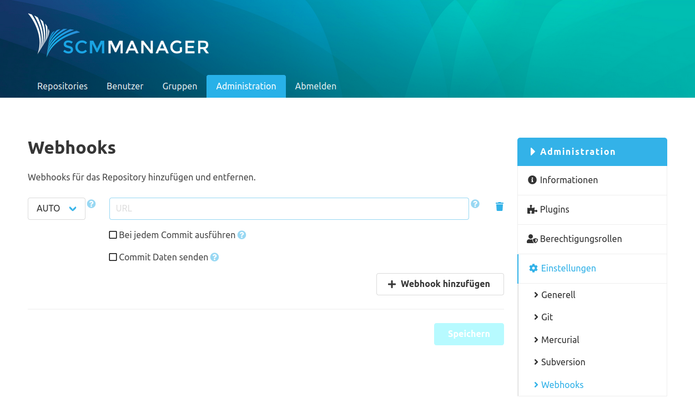

## Konfigurationsmaske
Es gibt eine globale und eine repository-spezifische Konfiguration für das Webhook-Plugin. Globale Webhooks werden für
alle Repositories der SCM-Manager-Instanz ausgeführt.

Es ist möglich, durch andere SCM-Manager-Plugins weitere Arten von Webhooks zu erstellen. Diese werden ggf. in diesen
Plugins beschrieben. Das Webhook-Plugin an sich stellt nur einen einfachen Webhook zur Verfügung:

Beim Registrieren eines solchen Webhooks kann man zwischen den Request-Typen "GET", "POST", "PUT" und "AUTO" wählen.
Wird "AUTO" gewählt, sendet der Webhook einen GET-Request an die angegebene URL,
es sei denn, es werden die Commit Daten mit dem Request übermittelt. In diesem Fall sendet der Webhook einen POST-Request.
In das Feld für die URL muss der genaue Endpunkt eingetragen werden, an die der Webhook den Request senden soll.

Im Standardfall wird ein Webhook pro Repository Push getriggert. Über eine Checkbox kann der Webhook aber auch pro Commit
ausgelöst werden. Die zweite Checkbox in der Konfiguration sorgt dafür, dass der Webhook die Commit Daten an den Request anhängt.



## Webhook URL Builder
Innerhalb der Webhook URL können kontext-sensitive Felder über Platzhalter definiert werden. Die Verwendung wird in folgenden Beispielen demonstriert.

### Repository

Beispiel: `example.com/${repository.namespace}/${repository.name}/${repository.type}`
Alle unterstützten Kontext-Felder finden Sie [hier](https://ecosystem.cloudogu.com/scm/repo/scm-manager-plugins/scm-el-plugin/code/sources/develop/src/main/java/com/cloudogu/scm/el/env/ImmutableEncodedRepository.java/).

### Commit / Changeset
Commit und Changeset sind Synonyme und beide Begriffe verweisen auf dasselbe Kontext-Objekt. 
Wird jeder Commit einzeln per Webhook verarbeitet, kann direkt auf das Commit Objekt zugegriffen werden.

Beispiel: `example.com/trigger/${changeset.id}/${changeset.author.name}`
Alle unterstützten Kontext-Felder finden Sie [hier](https://ecosystem.cloudogu.com/scm/repo/scm-manager-plugins/scm-el-plugin/code/sources/develop/src/main/java/com/cloudogu/scm/el/env/ImmutableEncodedChangeset.java/).

## Webhook Payload

### Liste von Commits

Beispiel:
```json
{
  "changeset": [
    {
      "author": {
        "mail": "scm-admin@scm-manager.org",
        "name": "SCM Administrator",
        "valid": true
      },
      "branches": [
        "main"
      ],
      "date": 1675686308000,
      "description": "My repo commit description",
      "id": "4fa9832c50e0ac57183023a30195d0f11a9dc0ef",
      "parents": [
        "74fb9da82be3d878be25a3c1c70a69fcbd3c0d66"
      ],
      "tags": null,
      "contributors": [
        {
          "type": "Committed-by",
          "person": {
            "mail": "noreply@scm-manager.org",
            "name": "SCM-Manager",
            "valid": true
          }
        }
      ],
      "signatures": [
        {
          "keyId": "0x1348937E258263F4",
          "type": "gpg",
          "status": "VERIFIED",
          "owner": {
            "empty": false,
            "present": true
          },
          "contacts": [
            {
              "mail": "scm-admin@scm-manager.org",
              "name": "SCM Administrator",
              "valid": true
            }
          ]
        }
      ]
    }
  ]
}
```

### Einzelner Commit

Beispiel:
```json
{
  "author": {
    "mail": "scm-admin@scm-manager.org",
    "name": "SCM Administrator",
    "valid": true
  },
  "branches": [
    "main"
  ],
  "date": 1675686490000,
  "description": "My commit desc",
  "id": "73757af953dd6b66c48aeae51407a5296ba9f9fa",
  "parents": [
    "4fa9832c50e0ac57183023a30195d0f11a9dc0ef"
  ],
  "tags": null,
  "contributors": [
    {
      "type": "Committed-by",
      "person": {
        "mail": "noreply@scm-manager.org",
        "name": "SCM-Manager",
        "valid": true
      }
    }
  ],
  "signatures": [
    {
      "keyId": "0x1348937E258263F4",
      "type": "gpg",
      "status": "VERIFIED",
      "owner": {
        "empty": false,
        "present": true
      },
      "contacts": [
        {
          "mail": "scm-admin@scm-manager.org",
          "name": "SCM Administrator",
          "valid": true
        }
      ]
    }
  ]
}
```

