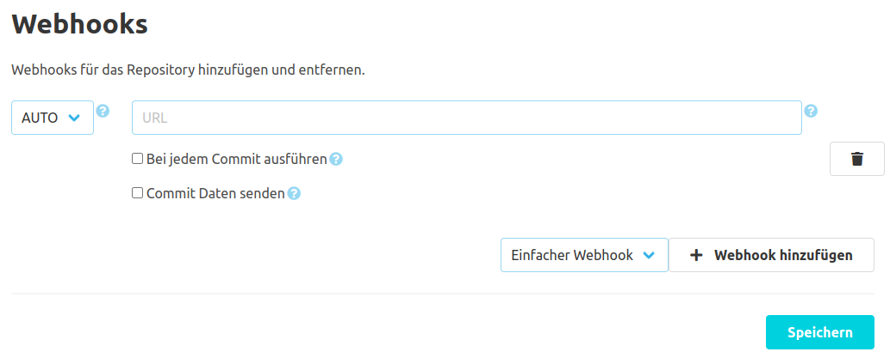

Es gibt eine globale und eine repository-spezifische Konfiguration für das Webhook-Plugin. Globale Webhooks betreffen alle Repositories, der SCM-Manager Instanz.

Beim Registrieren eines neuen Webhooks kann man zwischen den Request-Typen "GET", "POST", "PUT" und "AUTO" wählen. Wird "AUTO" gewählt, sendet der Webhook einen GET-Request. 
Es sei denn es werden die Commit Daten mit dem Request übermittelt, dann sendet der Webhook einen POST-Request. 
In das Feld für die URL muss der genaue Endpunkt eingetragen werden, wo der Webhook den Request hinsenden soll.

Im Standardfall wird ein Webhook pro Repository Push getriggert. Über eine Checkbox kann der Webhook aber auch pro Commit ausgelöst werden. 
Die zweite Checkbox in der Konfiguration sorgt dafür, dass der Webhook die Commit Daten an den Request hängt.

