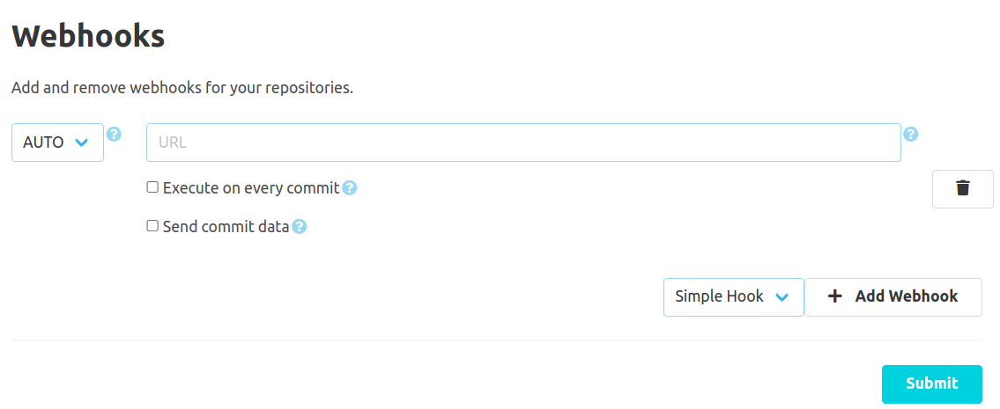

The SCM-Webhook-Plugin provides a global and a repository specific configuration. The global webhooks are executed for
all repositories on the SCM-Manager instance.

Other plugins may provide further kinds of webhooks. These will be described in the documentation of the providing plugin.
The webhook plugin itself only provides a simple webhook:

To register a new webhook you can select between "GET", "POST", "PUT", and "AUTO". If you select "AUTO", normally a GET
request will be sent to the given URL. Only if the webhook contains commit data, a POST request will be sent instead.
The URL must be set to the exact address where the requests should be sent to.

By default, the webhooks are triggered an each repository push. If needed, a webhook can also be configured to be
triggered for each commit. In addition, you can configure that the commit data should be attached to the webhook request.

